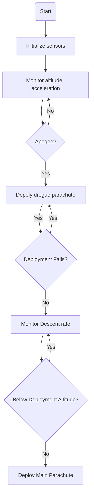

<a id="readme-top"></a>

<details>
  <summary>Table of Contents</summary>
  <ol>
    <li><a href="#Abstract">Abstract</a></li>
    <li><a href="#Acknowledgement">Acknowledgement</a></li>
    <li><a href="#Project_Overview">Project Overview</a></li>
    <li><a href="#Project_FlowChart">Project FlowChart</a></li>
    <li><a href="#Project_Directory_Structure">Project Directory Structure</a></li>
    <li><a href="#Project_Videos">Project Videos</a></li>
    <li><a href="#Conclusion">Conclusion</a></li>
    <li><a href="#contact">Contact</a></li>
    <li><a href="#License">License</a></li> 
  </ol>
</details>


## Abstract
<a id="Abstract"></a>
In high-power rocketry, deploying the main parachute at high altitude causes excessive drift and slow descent, leading to landings that are far away from the launch point. This complicates tracking and recovery, especially in rough terrain, increasing operational challenges and the risk of losing rocket valuable components. This project focuses on the design, development, and implementation of a dual recovery system for the N4 Nakuja high-power rocket to address these limitations. The system employs two parachutes deployed at different stages of descent: a drogue parachute deployed at apogee (highest altitude achieved during flight) stabilizes the initial descent without significant drift, and a main parachute deployed at a lower altitude ensures controlled and safe landing near the launchsite.The recovery system monitors the flight to determine the optimal timing, altitude, as well as the deployment mechanism for the parachutes.


## Acknowledgement
<a id="Acknowledgement"></a>
I acknowledge the efforts of my project partner  [Mr Ian Kiptoo](https://www.linkedin.com/in/ian-kiptoo-33446b211/)
 and my project supervisor [Dr Aoki Shohei](https://www.linkedin.com/in/shoheiaoki/?originalSubdomain=ke), for ensuring this project was successful. Many thanks to all our friends and family for the encouragement and support throughout the period.
 
## Project Overview
<a id="Project_Overview"></a>
The system has three functional modules:

1. **Software Module** - A state machine (code that determines the different flight stages of the rocket) for precise parachute deployment, a filtering algorithm to reduce sensor noise, and a web-based dashboard for the base station.
2. **Electronics Module** - The flight computer with sensors for altitude, acceleration, position, and orientation, plus a communication module for base station connectivity.
3. **Mechanical Module** - The dual-event ejection mechanism, including the main and drogue parachutes.

Detailed explanation on the design and implementation of each of these modules can be found in the [project documentation](https://drive.google.com/file/d/14VNpS6P4ipqwZZcbHW0bUXbVL5hBxgdX/view?usp=sharing)


## Project FlowChart
<a id="Project_FlowChart"></a>


## Project Directory Structure
<a id="Project_Directory_Structure"></a>
```bash
.Repository/
├── 📁 ESP32-Rocket-Recovery-code/
|    └── 📄 rocket_recovery.ino             Firmware for sensor integration (BMP180 & MPU6050), Kalman filtering, MQTT communication, and flight state detection on ESP32 microntroller
├── 📁 vite-project/                React web app User Interface for the recovery system dashboard.
├── 📄 README.md                   
```
## Project Videos
<a id="Project_Videos"></a>
Below is a video from a pop test conducted for the dual recovery system. The test aimed to evaluate the parachute ejection mechanism, and as seen in the video, it was successfully executed.
[](https://youtube.com/shorts/kO4SkFGHNq8?si=jlGlgapzhxJagvpD)

The video below demonstrates a hand-motion test for the software and electrical module. The PCB, housing the electronic circuitry, is manually moved to simulate a rocket’s flight trajectory. Sensor data from the flight computer—including acceleration and orientation from the MPU-6050 and altitude from the BMP180—is transmitted in real time to the base station dashboard via the MQTT protocol. 

[](https://youtube.com/shorts/o4fKfhlzHnQ?feature=share)

A live version of the basestation dashboard can be found in [here](https://nakuja-n4-rocket-dashboard.netlify.app/)

Running the demo on the base station dashboard simulates real-time data streaming from the flight sensors and visualizes all the flight stages determined from this data.
## Conclusion
<a id="Conclusion"></a>
The dual recovery system for the N4 rocket was successfully designed, implemented, and tested, incorporating an avionics bay, parachutes, a flight computer, and a state machine algorithm for flight phase detection. The nichrome wire ignition system and parachute deployment mechanisms performed reliably, while the state machine accurately identified all flight phases.  Preliminary tests confirm the system's feasibility for high-power rocket operations, with minor optimizations needed to enhance responsiveness and reliability.

## Contact
<a id="Contact"></a>
Kennedy Mwendwa - [Email](kennynyamai73@gmail.com) 

Ian Kiptoo - [Email](kiptooian021@gmail.com) 

## License
<a id="License"></a>
Distributed under the MIT License. See `LICENSE` for more information.

